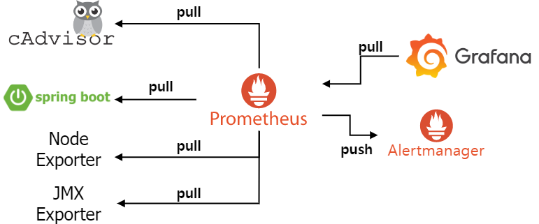
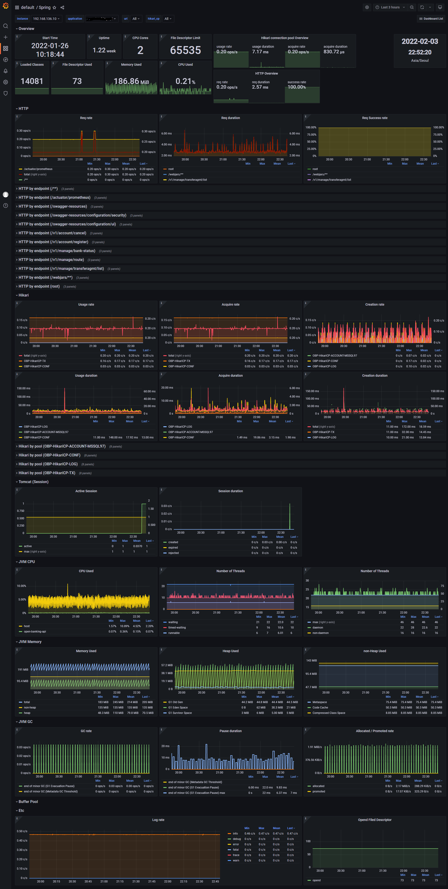

# hello-world-prometheus
Prometheus hello world 프로젝트

## 1. Architecture overview


## 2. Configuration
정상 설치 및 실행하기 위해 사용자 환경에 따라 기본적으로 변경되어야 하는 설정은 다음과 같다.

- Prometheus:
    - ./prometheus/sd_configs/file/*.yml
        - scrape target 추가를 위한 endpoint(IP 및 PORT 정보) 설정 필요        
- Grafana:
    - ./grafana/cert/*
        - HTTPS 인증서 및 키 파일 추가 필요
    - ./grafana/grafana.ini
        - server.domain: 도메인 설정 필요
        - server.cert_file, server.cert_key: 인증서 관련 파일 경로 설정 필요
        - security.admin_password: Grafana 관리자 계정 비밀번호 설정 필요
    - ./grafana/provisioning/datasources/datasources.yml
        - datasources.url: Prometheus endpoint 설정 필요

## 3. Installation
Docker를 이용해 설치 및 실행하며 여러 docker image를 사용하기 때문에 docker-compose를 이용해 container를 관리한다.

### 3.1 Execution environment info
해당 프로젝트는 아래 환경에서 정상 동작했음을 테스트했다.
- OS: CentOS Linux release 7.8.2003 (Core)
- Kernel version: 3.10.0-1127.18.2.el7.x86_64 #1 SMP Sun Jul 26 15:27:06 UTC 2020
- Docker version: 20.10.5
- Docker-compose version: 1.28.6, build 5db8d86f

### 3.2 Software Version Info
- Prometheus: [v2.32.0](https://github.com/prometheus/prometheus/releases/tag/v2.32.0)
- Cadvisor: [v0.37.5](https://github.com/google/cadvisor/releases/tag/v0.37.5)
- Node-exporter: [v1.3.1](https://github.com/prometheus/node_exporter/releases/tag/v1.3.1)
- Grafana: [8.3.3](https://github.com/grafana/grafana/releases/tag/v8.3.3)
- SpringBoot (maven dependency):
    - spring-boot-starter-parent: [2.3.1.RELEASE](https://github.com/spring-projects/spring-boot/releases/tag/v2.3.1.RELEASE)
    - micrometer-registry-prometheus: [1.8.2](https://github.com/micrometer-metrics/micrometer/releases/tag/v1.8.2)
    
### 3.3 Step by step
1. project clone하기
   ```
   git clone https://github.com/pyo-counting/hello-world-prometheus.git
   ```
2. 프로젝트 디렉토리로 이동
   ```
   cd hello-world-prometheus
   ```
3. docker-compose 실행 및 확인
   ```
   docker-compsoe up -d
   docker-compsoe ps
   ```
3. docker-compose down
   ```
   docker-compsoe down -v
   ```

### 3.4 Grafana dashboard overview
<p float="left">
  
  
</p>

## 4. Documentation
- [Prometheus](https://prometheus.io/docs/introduction/overview/)
- [Cadvisor](https://github.com/google/cadvisor)
- [Node-exporter](https://github.com/prometheus/node_exporter)
- [Grafana](https://grafana.com/docs/grafana/latest/)
- [SpringBoot](https://docs.spring.io/spring-boot/docs/current/reference/html/actuator.html)

## 5. Etc
- Architecture overview은 [draw.io](https://www.draw.io)를 통해 작성
- Prometheus에 대한 고가용성(High Availability)을 위해 [Cortex](https://cortexmetrics.io/docs/)를 이용할 수 있으며 관련해서는 [hello-world-cortex]() 프로젝트 참고